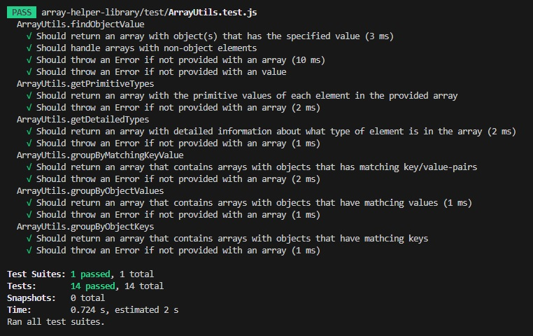

# Array Helper Library Test Report

This test report provides an overview of the automatic test suites conducted.

## Test Enviroment

- Testing framework: Jest

## Methods tested

- findObjectValues(value)
- getPrimitiveTypes()
- getDetailedTypes()
- groupByMatchingKeyValue()
- groupByObjectValues()
- groupByObjectKeys()

## Test results

All tests passed.
